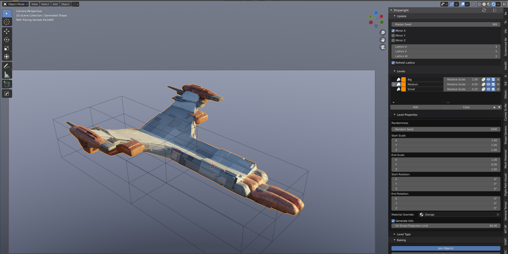

.. Shipwright documentation master file, created by
   sphinx-quickstart on Tue Sep 14 10:33:38 2021.
   You can adapt this file completely to your liking, but it should at least
   contain the root `toctree` directive.

############################################
The Shipwright V2 documentation
############################################

Automatically create sci fi objects with |The Shipwright|: a |Blender| add-on that combines the |Shape Generator| and the |Plating Generator| add-ons into one customisable set up.

.. |The Shipwright| raw:: html

   <a href="https://blendermarket.com/products/shipwright" target="_blank"><b>The Shipwright</b></a>

.. |Blender| raw:: html

   <a href="http://www.blender.org" target="_blank">Blender</a>

.. |Shape Generator| raw:: html

   <a href="https://blendermarket.com/products/shape-generator" target="_blank">Shape Generator</a>

.. |Plating Generator| raw:: html

   <a href="https://blendermarket.com/products/plating-generator" target="_blank">Plating Generator</a>

Features
========

* Create a wide range of objects just from a single number.
* Save set ups you like with the Presets feature.
* Dynamically change parameters and the objects will automatically update.
* Edit the objects using Blender's existing toolset.
* Customize the materials to suit your needs.
* Customize the shape with an editable lattice cage created around the object.
* All driven from one Panel based interface.
* Combine objects you already have with the new Levels System - not just generated ones.
* Export your object as a joined up Mesh with Smoothing and Baking options.
* Render out multiple variations with an 'Iterator' mode  (inspired by Chipp's idea for |KIT OPS SYNTH|)
* New Simpler installation - now no need for animation nodes.

.. |KIT OPS SYNTH| raw:: html

   <a href="https://blendermarket.com/products/kit-ops-synth" target="_blank">KIT OPS SYNTH</a>

.. toctree::
   :maxdepth: 2
   :caption: Contents:

   usage/installation
   usage/quickstart
   parameters/parameters_ref
   baking/baking
   iterator/iterator
   actions/actions
   contact/contact

Indices and tables
==================

* :ref:`genindex`
* :ref:`modindex`
* :ref:`search`
